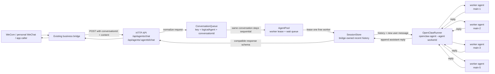
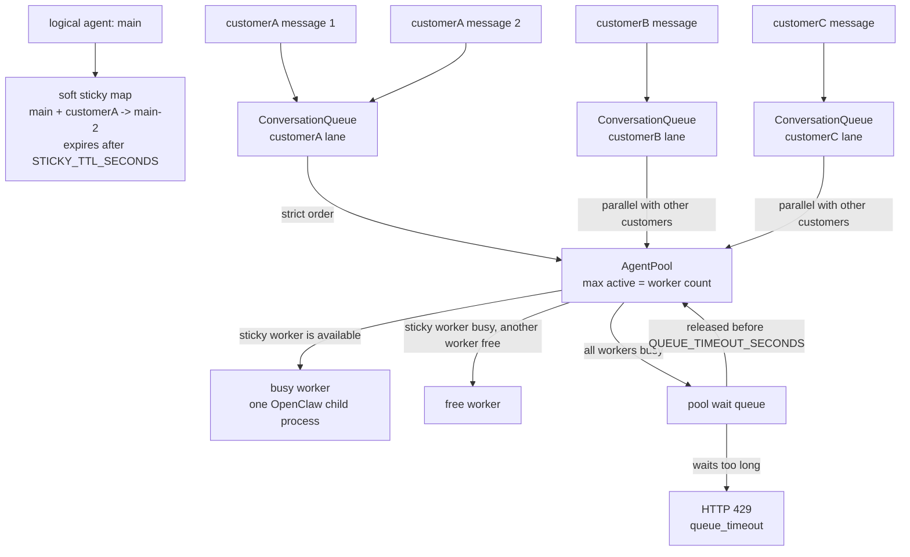
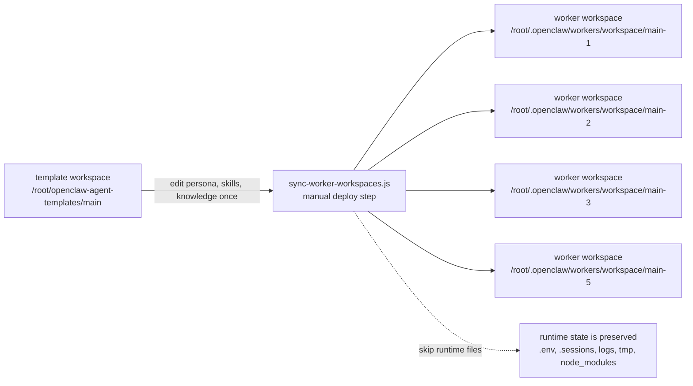

# Architecture

This bridge keeps the public chat API simple while moving concurrency control into a small set of internal components.

## Request Flow

## Pool And Queue Behavior

## Template Workspace Sync

## Component Responsibilities

| Component | Responsibility |
| --- | --- |
| `HttpServer` | Preserves the existing synchronous request and response protocol. |
| `ConversationQueue` | Serializes messages for the same `logicalAgent + conversationId`. |
| `AgentPool` | Leases one worker per request, tracks busy workers, and returns 429 after queue timeout. |
| `SessionStore` | Stores recent bridge-owned history so a conversation can move between workers safely. |
| `OpenClawRunner` | Starts exactly one `openclaw agent` child process for one worker run. |
| Template sync script | Copies one canonical logical-agent workspace into every worker workspace before serving traffic. |
