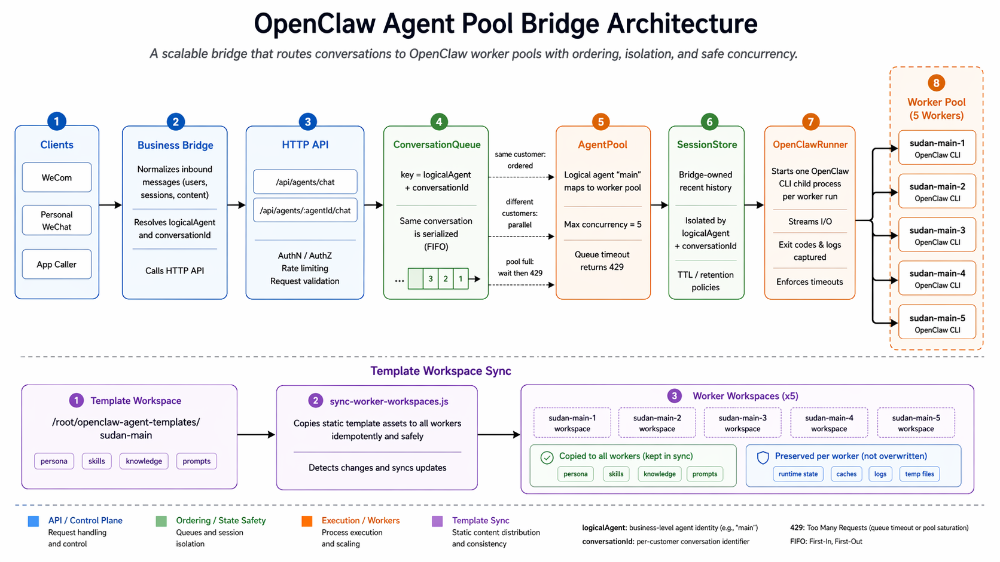
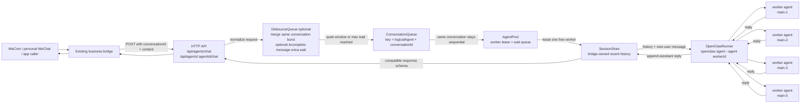
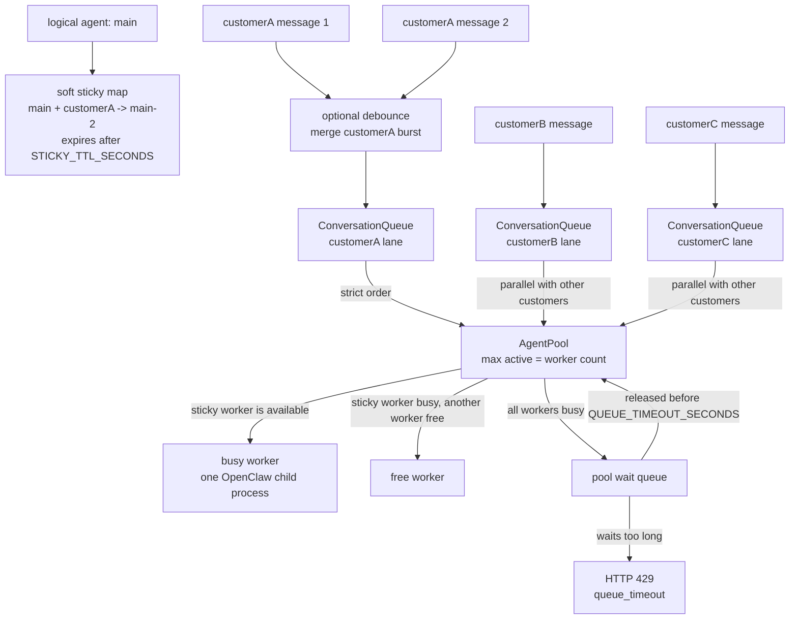
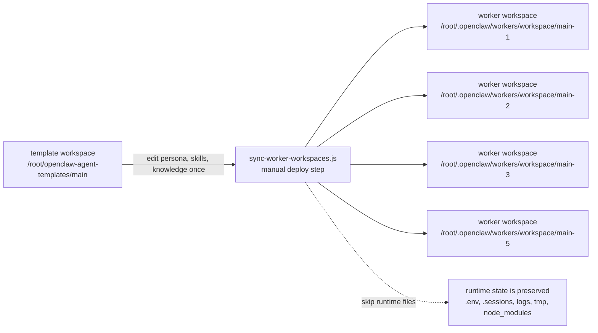

# Architecture

This bridge keeps the public chat API simple while moving concurrency control into a small set of internal components.

中文导读：这份文档解释 bridge 的内部结构。核心目标是保持外部 chat API 不变，同时在内部完成 worker pool 并发、同会话串行、session history 和模板同步。

## Terms / 术语

| Term | 中文说明 |
| --- | --- |
| logical agent | 外部调用方看到的客服 agent，例如 `main`、`snowchuang`。 |
| worker agent | 内部真实执行的 OpenClaw agent，例如 `main-1` 到 `main-5`。 |
| debounce queue | 可选防抖层，短时间合并同一客户连续消息。 |
| extra wait policy | 可选策略；最后一条像没说完时延长防抖等待。 |
| conversation queue | 按 `logicalAgent + conversationId` 串行同一会话的队列。 |
| pool wait queue | 所有 worker 都忙时，请求等待空闲 worker 的队列。 |
| sticky binding | conversation 优先复用上次 worker 的软绑定。 |
| bridge-owned history | bridge 自己保存的最近对话历史，用来跨 worker 保持上下文。 |

## Request Flow / 请求链路

中文说明：外部业务桥仍然调用 HTTP chat 接口；bridge 先按 conversation 排队，再租用一个空闲 worker，最后用 OpenClaw CLI 执行该 worker agent。

## Pool And Queue Behavior / Pool 和队列行为

中文说明：同一个 conversation 会先可选防抖合并，再严格排队；不同 conversation 可以并发。worker 全忙时，请求进入 pool wait queue；等待超过 `QUEUE_TIMEOUT_SECONDS` 会返回 429。

## Template Workspace Sync / 模板同步

中文说明：模板 workspace 是每个 logical agent 的标准版本。修改人格、prompt、skills、knowledge 后，同步到所有 worker workspace。同步会保留 `.env`、`.sessions`、logs、tmp、`node_modules` 等运行态文件。

## Component Responsibilities / 组件职责

| Component | Responsibility |
| --- | --- |
| `HttpServer` | Preserves the existing synchronous request and response protocol. |
| `DebounceQueue` | Optionally merges short same-conversation message bursts into one agent turn. |
| Extra wait policy | Optionally extends debounce when the last message looks unfinished. |
| `ConversationQueue` | Serializes messages for the same `logicalAgent + conversationId`. |
| `AgentPool` | Leases one worker per request, tracks busy workers, and returns 429 after queue timeout. |
| `SessionStore` | Stores recent bridge-owned history so a conversation can move between workers safely. |
| `OpenClawRunner` | Starts exactly one `openclaw agent` child process for one worker run. |
| Template sync script | Copies one canonical logical-agent workspace into every worker workspace before serving traffic. |

中文补充：

- `HttpServer` 保持旧接口兼容，并提供 `/health`、`/metrics`、`/admin/pool`。
- `DebounceQueue` 可选启用，解决“客户连续发几条，agent 回复多次”的问题。
- `Extra wait policy` 可选启用，解决“用户明显还没说完，需要多等一下”的问题。
- `ConversationQueue` 解决“同一个客户连续发消息不能乱序”的问题。
- `AgentPool` 解决“多个客户能否真正并发，以及 worker 全忙时怎么办”的问题。
- `SessionStore` 解决“conversation 换 worker 后仍能看到最近上下文”的问题。
- `OpenClawRunner` 只负责启动一次 worker agent，不承载调度逻辑。
