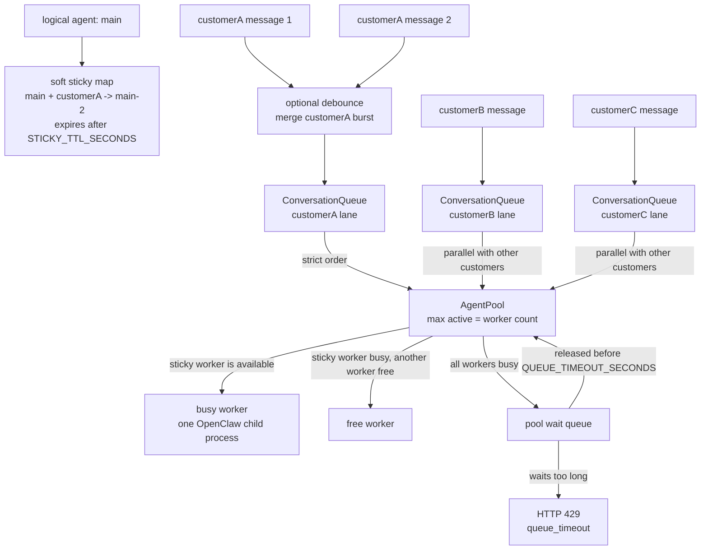
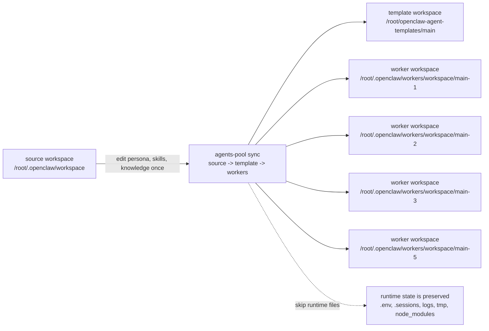

# Architecture

This bridge keeps the public chat API simple while moving concurrency control into a small set of internal components.

中文导读：这份文档解释 bridge 的内部结构。核心目标是保持外部 chat API 不变，同时在内部完成 worker pool 并发、同会话串行、session history 和模板同步。

## Terms / 术语

| Term | 中文说明 |
| --- | --- |
| logical agent | 外部调用方看到的客服 agent，例如 `main`、`snowchuang`。 |
| worker agent | 内部真实执行的 OpenClaw agent，例如 `main-1` 到 `main-5`。 |
| debounce queue | 可选防抖层，短时间合并同一客户连续消息。 |
| extra wait policy | 可选策略；最后一条像没说完时延长防抖等待。 |
| retrieval adapter | 可选检索适配层，从 FAQ 文件或 RAG endpoint 提供参考资料。 |
| prompt adapter | 可选 prompt 适配层，默认保持原 prompt，可用模板为不同客服定制 prompt。 |
| rich chat content | emoji、图片、文件、音频和 TTS 请求的 JSON 元数据；bridge 会归一化为 OpenClaw 可读的 prompt 文本。 |
| conversation queue | 按 `logicalAgent + conversationId` 串行同一会话的队列。 |
| pool wait queue | 所有 worker 都忙时，请求等待空闲 worker 的队列。 |
| sticky binding | conversation 优先复用上次 worker 的软绑定。 |
| bridge-owned history | bridge 自己保存的最近对话历史，用来跨 worker 保持上下文。 |

## Request Flow / 请求链路

中文说明：外部业务桥仍然调用 HTTP chat 接口；bridge 先把文本、emoji、图片/文件/音频元数据和 TTS 请求归一化，再按 conversation 排队、租用空闲 worker，最后用 OpenClaw CLI 执行该 worker agent。

```mermaid
flowchart LR
  C["WeCom / personal WeChat / app caller"]
  B["Existing business bridge"]
  H["HTTP API<br/>/api/agents/chat<br/>/api/agents/:agentId/chat"]
  D["DebounceQueue optional<br/>merge same conversation burst<br/>optional incomplete-message extra wait"]
  G["RetrievalAdapter optional<br/>none, faq, or rag"]
  A["PromptAdapter optional<br/>none or template"]
  Q["ConversationQueue<br/>key = logicalAgent + conversationId"]
  P["AgentPool<br/>worker lease + wait queue"]
  S["SessionStore<br/>bridge-owned recent history"]
  R["OpenClawRunner<br/>openclaw agent --agent workerId"]
  W1["worker agent<br/>main-1"]
  W2["worker agent<br/>main-2"]
  W3["worker agent<br/>main-3"]
  W5["worker agent<br/>main-5"]

  C --> B
  B -->|"POST with conversationId + content"| H
  H -->|"normalize text + rich content"| D
  D -->|"quiet window or max wait reached"| Q
  Q -->|"same conversation stays sequential"| P
  P -->|"lease one free worker"| S
  S -->|"history + rich user message"| G
  G -->|"retrieval context"| A
  A -->|"final prompt"| R
  R --> W1
  R --> W2
  R --> W3
  R --> W5
  W1 -->|"reply"| R
  W2 -->|"reply"| R
  W3 -->|"reply"| R
  W5 -->|"reply"| R
  R -->|"append assistant reply"| S
  S -->|"compatible response schema"| H
  H --> B
  B --> C
```

## Pool And Queue Behavior / Pool 和队列行为

中文说明：同一个 conversation 会先可选防抖合并，再严格排队；不同 conversation 可以并发。worker 全忙时，请求进入 pool wait queue；等待超过 `QUEUE_TIMEOUT_SECONDS` 会返回 429。

## Source, Template, And Worker Sync / 源、模板和 worker 同步

中文说明：logical agent 的源 workspace 是权威内容；模板 workspace 和所有 worker workspace 都由它同步生成。修改人格、prompt、skills、knowledge 后，先写源 workspace，再同步到模板和 workers。同步会保留 `.env`、`.sessions`、logs、tmp、`node_modules` 等运行态文件。

## Component Responsibilities / 组件职责

| Component | Responsibility |
| --- | --- |
| `HttpServer` | Preserves the existing synchronous request and response protocol, including optional rich content metadata and TTS request flags. |
| `DebounceQueue` | Optionally merges short same-conversation message bursts into one agent turn. |
| Extra wait policy | Optionally extends debounce when the last message looks unfinished. |
| `RetrievalAdapter` | Optionally fetches FAQ/RAG context before prompt rendering; failures are recorded but chat falls back to empty context. |
| `PromptAdapter` | Optionally renders the final prompt sent to OpenClaw; `none` keeps the default prompt, `template` fills a Markdown template. |
| `ConversationQueue` | Serializes messages for the same `logicalAgent + conversationId`. |
| `AgentPool` | Leases one worker per request, tracks busy workers, and returns 429 after queue timeout. |
| `SessionStore` | Stores recent bridge-owned history so a conversation can move between workers safely. |
| `OpenClawRunner` | Starts exactly one `openclaw agent` child process for one worker run and preserves rich output payloads when OpenClaw returns them. |
| `SoulManager` | Reads and overwrites each logical agent source `SOUL.md`, then syncs that file to the template and configured worker workspaces. |
| `SoulDistiller` | Uses a shared customer SOUL distillation skill plus an OpenClaw distiller agent to turn uploaded chat logs into a complete `SOUL.md`. |
| `agents-pool sync` | Copies one canonical logical-agent source workspace into its template and worker workspaces before serving traffic. |

中文补充：

- `HttpServer` 保持旧接口兼容，并提供 `/health`、`/metrics`、`/admin/pool`。emoji 作为文本透传；图片、文件、音频用 URL/mediaId/filename/mimeType/transcript 等 JSON 元数据传入。
- `DebounceQueue` 可选启用，解决“客户连续发几条，agent 回复多次”的问题。
- `Extra wait policy` 可选启用，解决“用户明显还没说完，需要多等一下”的问题。
- `RetrievalAdapter` 可选启用，解决“不同客服需要查 FAQ/RAG，但不能写死进通用 pool”的问题。
- `PromptAdapter` 可选启用，解决“不同客服需要不同 prompt，但不能写死进通用 pool”的问题。
- `ConversationQueue` 解决“同一个客户连续发消息不能乱序”的问题。
- `AgentPool` 解决“多个客户能否真正并发，以及 worker 全忙时怎么办”的问题。
- `SessionStore` 解决“conversation 换 worker 后仍能看到最近上下文”的问题。
- `OpenClawRunner` 只负责启动一次 worker agent，不承载调度逻辑；如果 OpenClaw JSON 返回 image/file/audio payload，会作为响应的 `outputs` 透出。
- `SoulManager` 负责 `GET/PUT /api/agents/:agentId/soul`，先改 logical agent 源 workspace 的 `SOUL.md`，再同步模板和对应 worker 的 `SOUL.md`。
- `SoulDistiller` 负责 `POST /api/agents/:agentId/soul/distill`，聊天记录上传后先经通用 skill 蒸馏，再写回 `SOUL.md`。

## Rich Chat Content / 富消息边界

The bridge is still a JSON HTTP API. It does not upload or store binary files. Callers should upload media through their own channel first, then pass metadata into `content.attachments`.

中文说明：不要把图片、文件、音频二进制直接塞进 chat JSON。正确链路是：业务上游先拿到可访问 URL 或平台 mediaId，bridge 只负责把这些元数据组织成 agent 可读的上下文。

Supported inbound attachment fields:

| Field | Purpose |
| --- | --- |
| `type` | `image`、`file`、`audio`。`voice` 会归一化为 `audio`。 |
| `url` / `mediaId` | 素材访问地址或业务平台素材 ID。 |
| `filename` / `name` | 文件名，帮助 agent 理解素材。 |
| `mimeType` | 例如 `image/png`、`application/pdf`、`audio/mpeg`。 |
| `caption` / `alt` | 图片说明。 |
| `transcript` | 语音转写文本；有转写时 agent 能直接理解用户语音内容。 |

TTS is expressed as a response request, for example `content.tts=true` or `content.tts={"voice":"zh-CN-XiaoxiaoNeural","lang":"zh-CN"}`. The bridge passes that intent to the prompt and returns `tts.requested=true`; actual audio generation is handled by OpenClaw native TTS or an agent skill.
